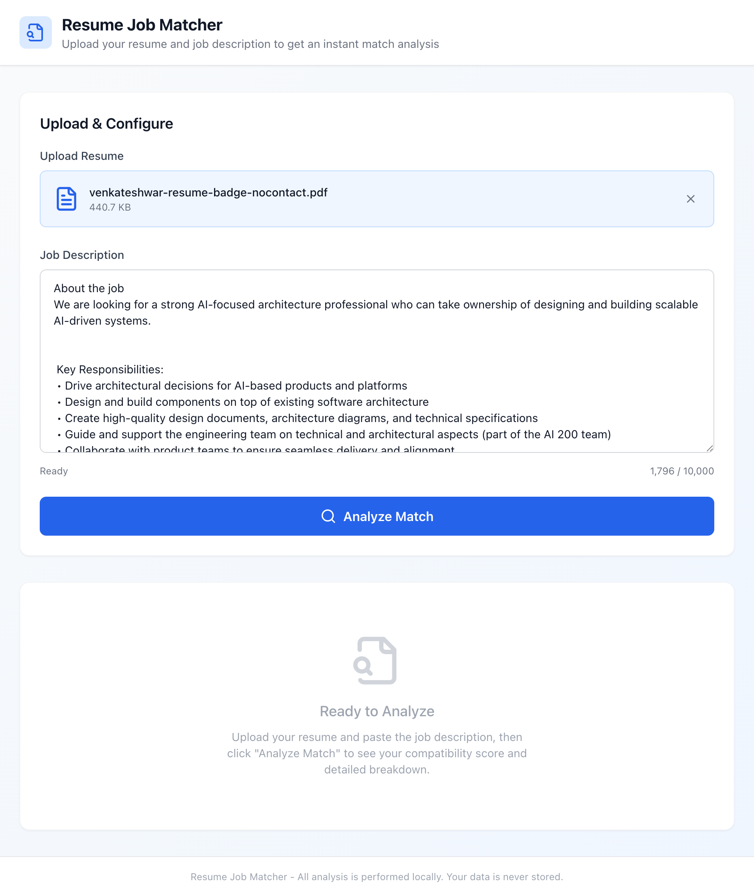
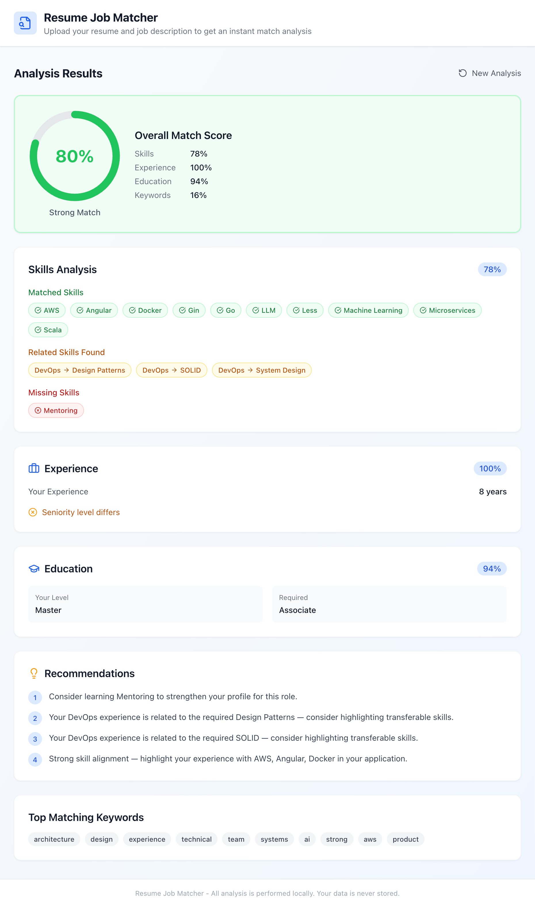

# Resume Job Matcher

An AI-powered resume-to-job matching tool that helps HR teams and job seekers instantly evaluate how well a resume fits a specific job description. Upload a resume (PDF or DOCX), paste the job description, and get a comprehensive match analysis powered by OpenAI.

## Why This Tool?

Hiring managers spend an average of 7 seconds scanning a resume. This tool automates that process with AI, providing an objective, detailed breakdown that helps:

- **HR teams** shortlist candidates faster with data-driven match scores
- **Job seekers** identify skill gaps and tailor their applications
- **Recruiters** compare candidates against role requirements at scale

## Screenshots

### Upload & Analyze
Upload your resume and paste the full job description. Supports PDF and DOCX formats up to 5MB.



### Detailed Results Dashboard
Get a complete breakdown with overall match score, skill analysis, experience comparison, education match, and actionable recommendations.



## Features

- **AI-Powered Analysis** - Uses OpenAI (GPT-4o-mini) for deep semantic understanding of resumes and job descriptions
- **Overall Match Score** - Weighted percentage combining skills, experience, education, and keyword relevance
- **Skills Breakdown** - Matched skills (green), related/partial matches (amber), and missing skills (red)
- **Experience Comparison** - Years of experience vs. requirements with seniority level alignment
- **Education Match** - Degree level and field relevance scoring
- **AI Insights** - Strengths, concerns, interview tips, culture fit assessment, and salary range estimates
- **Actionable Recommendations** - Prioritized suggestions to improve your match
- **Top Matching Keywords** - Domain-specific terms shared between resume and job description
- **Resume Parsing** - Extracts text from PDF and DOCX files using pdf-parse and mammoth
- **Privacy First** - Resume files are processed in memory, never stored on disk

## Tech Stack

| Layer | Technology |
|-------|-----------|
| **Frontend** | React 18, TypeScript, Vite, Tailwind CSS, Lucide Icons |
| **Backend** | Node.js, Express, TypeScript |
| **AI** | OpenAI GPT-4o-mini (configurable model) |
| **Parsing** | pdf-parse (PDF), mammoth (DOCX) |
| **Security** | Helmet, CORS, express-rate-limit, Zod validation |
| **Logging** | Pino (structured JSON logging) |
| **Testing** | Jest, Supertest |
| **DevOps** | Docker, GitHub Actions CI |

## Getting Started

### Prerequisites

- Node.js 20+
- An [OpenAI API key](https://platform.openai.com/api-keys)

### Installation

```bash
# Clone the repository
git clone https://github.com/venkateshwarreddyr/resume-job-matcher.git
cd resume-job-matcher

# Install dependencies
npm install
cd server && npm install
cd ../client && npm install
cd ..

# Configure environment
cp .env.example .env
# Edit .env and add your OPENAI_API_KEY
```

### Configuration

Create a `.env` file in the project root:

```env
PORT=3001
NODE_ENV=development
CORS_ORIGIN=http://localhost:5173
UPLOAD_MAX_SIZE=5242880
RATE_LIMIT_WINDOW=900000
RATE_LIMIT_MAX=100
LOG_LEVEL=info
OPENAI_API_KEY=sk-your-openai-api-key
OPENAI_MODEL=gpt-4o-mini
```

### Run Development Servers

```bash
# Start both client (:5173) and server (:3001)
npm run dev

# Or start them separately
npm run dev:server   # Express API on :3001
npm run dev:client   # Vite dev server on :5173
```

Open [http://localhost:5173](http://localhost:5173) in your browser.

### Build for Production

```bash
npm run build        # Builds server (TypeScript) and client (Vite)
npm start            # Starts production server on :3001
```

## API Reference

### `POST /api/analyze`

Analyze a resume against a job description.

**Request:** `multipart/form-data`

| Field | Type | Required | Description |
|-------|------|----------|-------------|
| `resume` | File | Yes | PDF or DOCX file (max 5MB) |
| `jobDescription` | String | Yes | Job description text (50-10,000 characters) |

**Example:**

```bash
curl -X POST http://localhost:3001/api/analyze \
  -F "resume=@resume.pdf" \
  -F "jobDescription=We are looking for a Senior Software Engineer with 5+ years..."
```

**Response:** `200 OK`

```json
{
  "overallScore": 85,
  "skillMatch": {
    "score": 78,
    "matched": ["AWS", "Angular", "Docker", "Go"],
    "missing": ["Mentoring"],
    "partial": [{ "skill": "Design Patterns", "relatedFound": "DevOps" }]
  },
  "experienceMatch": {
    "score": 100,
    "resumeYears": 8,
    "requiredYears": 5,
    "seniorityAlignment": true
  },
  "educationMatch": {
    "score": 94,
    "resumeLevel": "Master",
    "requiredLevel": "Bachelor",
    "fieldRelevance": 90
  },
  "keywordRelevance": {
    "score": 16,
    "topSharedTerms": ["architecture", "design", "systems", "ai"]
  },
  "recommendations": [
    "Consider learning Mentoring to strengthen your profile for this role.",
    "Strong skill alignment — highlight your experience with AWS, Angular, Docker."
  ],
  "aiInsights": {
    "summary": "Strong candidate with solid architecture experience and relevant technical skills.",
    "strengths": ["Deep cloud infrastructure expertise", "8 years exceeds requirement"],
    "concerns": ["No mentoring experience listed"],
    "interviewTips": ["Prepare system design examples", "Discuss AI architecture decisions"],
    "cultureFit": "Good fit for a technical leadership role in an AI-focused team",
    "salaryRange": "$150,000 - $190,000"
  }
}
```

### `GET /api/health`

Health check endpoint.

```json
{ "status": "ok", "uptime": 12345, "version": "1.0.0" }
```

### Error Responses

| Status | Description |
|--------|-------------|
| `400` | Invalid file type, missing fields, file too large, job description too short |
| `422` | Resume could not be parsed (encrypted PDF, image-only scan) |
| `429` | Rate limit exceeded |
| `500` | Server error (missing API key, OpenAI failure) |

## Project Structure

```
resume-job-matcher/
├── client/                    # React + Vite frontend
│   └── src/
│       ├── components/        # FileUpload, ResultsDashboard, MatchScoreGauge,
│       │                      # SkillsCard, ExperienceCard, EducationCard,
│       │                      # AIInsightsCard, RecommendationsCard
│       ├── hooks/             # useAnalyze (state management)
│       ├── api/               # Axios API client
│       ├── types/             # TypeScript interfaces
│       └── utils/             # Score formatting helpers
├── server/                    # Express + TypeScript backend
│   ├── src/
│   │   ├── services/
│   │   │   ├── aiService.ts       # OpenAI integration & analysis
│   │   │   ├── analyzerService.ts # Orchestrator (parse → AI → response)
│   │   │   └── parserService.ts   # PDF & DOCX text extraction
│   │   ├── middleware/            # Upload (multer), validation (zod), error handler
│   │   ├── routes/                # /api/analyze, /api/health
│   │   ├── config/                # Environment configuration
│   │   └── utils/                 # Pino logger
│   └── tests/                     # Unit + integration tests
├── docs/                      # Screenshots
├── .github/workflows/ci.yml  # GitHub Actions CI
├── Dockerfile                 # Multi-stage production build
├── docker-compose.yml
└── .env.example
```

## Testing

```bash
# Run all server tests
cd server && npm test

# Run with coverage
cd server && npx jest --coverage
```

## Docker

```bash
# Build and run
docker compose up --build

# Or manually
docker build -t resume-job-matcher .
docker run -p 3001:3001 --env-file .env resume-job-matcher
```

## How It Works

1. **Upload** - User uploads a resume (PDF/DOCX) and pastes a job description
2. **Parse** - Server extracts raw text from the resume using pdf-parse or mammoth
3. **Analyze** - Resume text and job description are sent to OpenAI with a structured prompt
4. **Score** - AI returns weighted scores for skills, experience, education, and keyword relevance
5. **Insights** - AI provides strengths, concerns, interview tips, culture fit, and salary estimates
6. **Display** - Results are rendered in an interactive dashboard with color-coded indicators

## License

MIT
